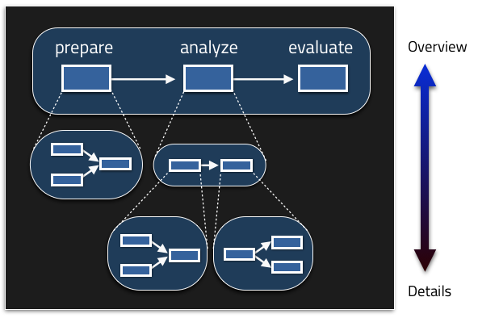
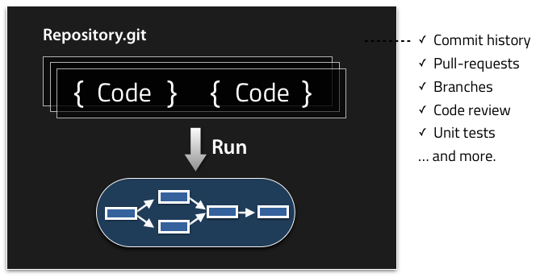

# Architecture

## Automating workflow with Digdag

A workflow automates any kinds of manual operations. You'll define a sequence of tasks as workflow, then Digdag keeps running it for you. Tasks are defined using operator plugins so that you can control various kinds of systems from the central workflow engine (see also [list of built-in operator plugins](operators.html)).

As the runtime framework of the plugins, Digdag takes care of the rest of issues around workload automation so that you can focus on automation. If a task fails, Digdag sends an alerts. If the workflow doesn't finish within expected amount of tiem, Digdag sends a notification. Digdag starts workflow automatically based on scheduling options.

Tasks can run on local machine, distributed servers, or in a Docker container.

## Organizing tasks by groups

As you automate complex workflow, the definition becomes complicated quickly. Using Digdag, you can organize tasks into groups. When you review the definition, you will see from a bird's view, then dive in to details. It makes it easy to debug and review your workflow during development. In production environment, it helps administrators to know what's happening and how to fix problems.

A task starts if there're no dependent siblings, or all of them successfully completed. When a parent of a group runs, it runs its children. When all of them completed successfully, their parent also completes successfully. But when a child failed, the failed child and its parent also fails. The entire execution finishes when the root task completes or fails.

### Parameters

Grouping tasks is used also for passing parameters between tasks. A parent task can export variables for children tasks (as like UNIX shell's *export* command sets environment variables). A parent can generate children tasks at run time so that it can run different tasks depending on the results of previous tasks. See [defining variables](workflow_definition.html#defining-variables) section for details.

See [workflow definition](workflow_definition.html) section for the definition syntax.

## Workflow as code

Digdag workflow is defined as code. This brings best practice of software development: version management, code review, tests, and collaboration using pull-requests. You can push a workflow to a git repository, and anyone can pull it to reproduce the same results with you.

## Running with local mode

Digdag is a single-file executable command. Creating and running a new workflow is as easy as Makefile.

Files with `*.dig` suffix are used for workflow definitions. `digdag run my_workflow.dig` command runs the workflow.

Once you developed and tested a workflow on a local machine, you will want to push it to a server so that the workflow runs periodically.

## Running on a server

Files with `*.dig` suffix and other files at the same directory are called **project**. You can push an entire project to a Digdag server so that Digdag server runs workflows on the server.

### Running tasks on Docker

You can use [Docker](https://www.docker.com/) to run tasks in a container.  If `docker` option is set, tasks run in a docker container.

    _export:
      docker:
        image: ubuntu:14.04
    
    +step1:
      py>: tasks.MyWorkflow.step1

## Next steps

* [Getting started](scheduling_workflow.html)
* [Workflow definition](workflow_definition.html)
* [More choices of operators](operators.html)

